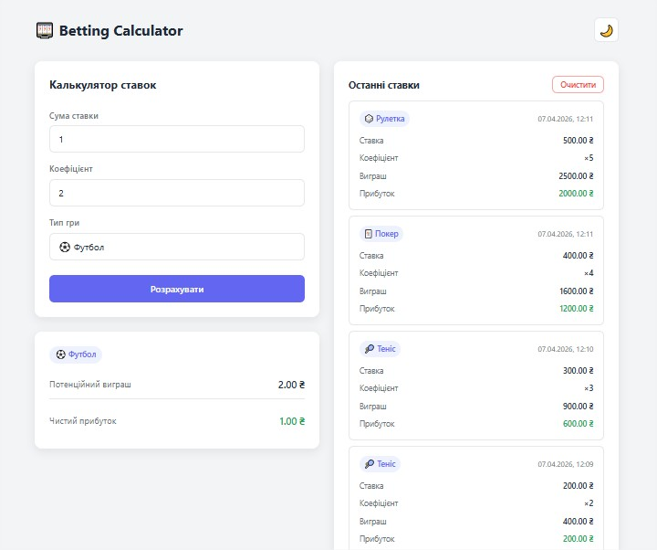

# 🎰 Betting Calculator

A responsive betting calculator built with React + TypeScript and Vite.  
Calculate potential winnings, track your bet history, and switch between light and dark themes.



## Features

- **Real-time calculation** — potential win and profit update instantly as you type
- **Form validation** — inline error messages for all fields, no alerts
- **Bet history** — last 5 bets saved to localStorage, persists on page reload
- **Dark / Light mode** — toggle with system preference fallback
- **TypeScript** — full type coverage across components and hooks
- **Responsive** — works from 320px to 1440px

## Tech Stack

- React 18 + TypeScript
- Vite
- CSS Modules

## Getting Started

```bash
git clone https://github.com/MykytaMusaiev/betting-calculator.git
cd betting-calculator
npm install
npm run dev
```

Open [http://localhost:5173](http://localhost:5173) in your browser.

## Build

```bash
npm run build
```

## Project Structure

src/
├── components/
│ ├── BetForm/
│ ├── BetResult/
│ ├── BetHistory/
│ └── BetHistoryItem/
├── shared/
│ ├── hooks/
│ │ ├── useBetCalculator.ts
│ │ └── useTheme.ts
│ ├── types/
│ │ └── bet.ts
│ └── constants/
│ ├── gameTypes.ts
│ └── currency.ts
├── App.tsx
├── App.module.css
├── main.tsx
└── global.css

## Bonus Features Implemented

| Bonus                            | Status |
| -------------------------------- | ------ |
| TypeScript                       | ✅     |
| Custom Hook (`useBetCalculator`) | ✅     |
| Dark / Light Mode                | ✅     |
